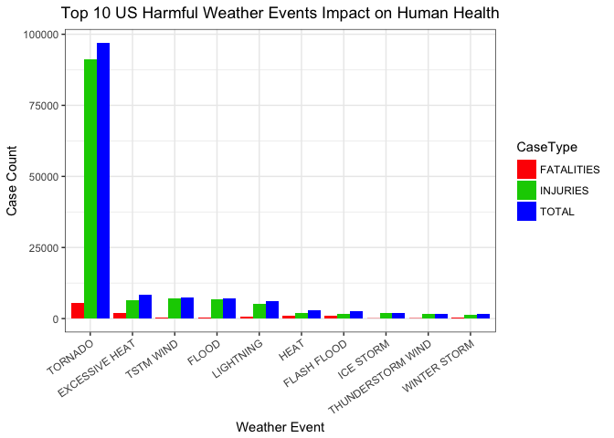
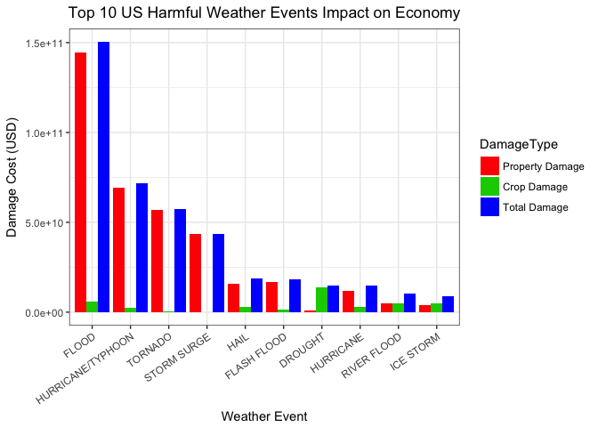

## 1. Synopsis
Storms and other severe weather events can cause both human health and economic problems for communities and municipalities. The U.S. National Oceanic and Atmospheric Administrations (NOAA) storm database tracks characteristics of major storms and weather events in the United States from 1950 to November 2011, including when and where they occur, as well as estimates of any fatalities, injuries, and property damage. This data was used to explore the effects of severe weather events on both population health and economy in the US. The following are the details consist of tables, figures and the R code for the entire analysis about how to answer these two questions:  

* Across the United States, which types of events are most harmful with respect to population health?
* Across the United States, which types of events have the greatest economic consequences?

## 2. Data Processing
### Data
The data is in the form of a comma-separated-value file compressed via the bzip2 algorithm. 

* [Storm Data](https://d396qusza40orc.cloudfront.net/repdata%2Fdata%2FStormData.csv.bz2) [47Mb]

Documentation about the database and variables defined.

* [National Weather Service Storm Data Documentation](https://d396qusza40orc.cloudfront.net/repdata%2Fpeer2_doc%2Fpd01016005curr.pdf)
* [National Climatic Data Center Storm Events FAQ](https://d396qusza40orc.cloudfront.net/repdata%2Fpeer2_doc%2FNCDC%20Storm%20Events-FAQ%20Page.pdf)

### 1a. Download the raw data and extract the data into a dataframe

```r
## load library
library(reshape2)
library(ggplot2)
library(plotly)
```

```
## 
## Attaching package: 'plotly'
```

```
## The following object is masked from 'package:ggplot2':
## 
##     last_plot
```

```
## The following object is masked from 'package:stats':
## 
##     filter
```

```
## The following object is masked from 'package:graphics':
## 
##     layout
```

```r
#Download the raw data file
if(!file.exists("stormData.csv.bz2")) {
  download.file("https://d396qusza40orc.cloudfront.net/repdata%2Fdata%2FStormData.csv.bz2",
  destfile = "stormData.csv.bz2", method = "curl")
}

# Read data
rawData <- read.csv(bzfile("stormData.csv.bz2"), sep=",", header=T); dim(rawData)
```

```
## [1] 902297     37
```

```r
# see variables name
names(rawData)
```

```
##  [1] "STATE__"    "BGN_DATE"   "BGN_TIME"   "TIME_ZONE"  "COUNTY"    
##  [6] "COUNTYNAME" "STATE"      "EVTYPE"     "BGN_RANGE"  "BGN_AZI"   
## [11] "BGN_LOCATI" "END_DATE"   "END_TIME"   "COUNTY_END" "COUNTYENDN"
## [16] "END_RANGE"  "END_AZI"    "END_LOCATI" "LENGTH"     "WIDTH"     
## [21] "F"          "MAG"        "FATALITIES" "INJURIES"   "PROPDMG"   
## [26] "PROPDMGEXP" "CROPDMG"    "CROPDMGEXP" "WFO"        "STATEOFFIC"
## [31] "ZONENAMES"  "LATITUDE"   "LONGITUDE"  "LATITUDE_E" "LONGITUDE_"
## [36] "REMARKS"    "REFNUM"
```

### 1b. Only get the following 7 variables related to questions.
* EVTYPE     - a measure of event type (e.g. tornado, flood, etc.)
* FATALITIES - a measure of harm to human health
* INJURIES   - a measure of harm to human health
* PROPDMG    - a measure of property damage and hence economic damage in USD
* PROPDMGEXP - a measure of magnitude of property damage (e.g. thousands, millions USD, etc.)
* CROPDMG    - a measure of crop damage and hence economic damage in USD
* CROPDMGEXP - a measure of magnitude of crop damage (e.g. thousands, millions USD, etc.)


```r
subData <- rawData[ , c("EVTYPE", "FATALITIES", "INJURIES", "PROPDMG", "PROPDMGEXP", "CROPDMG", "CROPDMGEXP")]
str(subData)
```

```
## 'data.frame':	902297 obs. of  7 variables:
##  $ EVTYPE    : Factor w/ 985 levels "   HIGH SURF ADVISORY",..: 834 834 834 834 834 834 834 834 834 834 ...
##  $ FATALITIES: num  0 0 0 0 0 0 0 0 1 0 ...
##  $ INJURIES  : num  15 0 2 2 2 6 1 0 14 0 ...
##  $ PROPDMG   : num  25 2.5 25 2.5 2.5 2.5 2.5 2.5 25 25 ...
##  $ PROPDMGEXP: Factor w/ 19 levels "","-","?","+",..: 17 17 17 17 17 17 17 17 17 17 ...
##  $ CROPDMG   : num  0 0 0 0 0 0 0 0 0 0 ...
##  $ CROPDMGEXP: Factor w/ 9 levels "","?","0","2",..: 1 1 1 1 1 1 1 1 1 1 ...
```

### 1c. Convert property damage and crop damage to appropriate values


```r
unique(subData$PROPDMGEXP)
```

```
##  [1] K M   B m + 0 5 6 ? 4 2 3 h 7 H - 1 8
## Levels:  - ? + 0 1 2 3 4 5 6 7 8 B h H K m M
```

```r
unique(subData$CROPDMGEXP)
```

```
## [1]   M K m B ? 0 k 2
## Levels:  ? 0 2 B k K m M
```

### 1d. A function for converting
H or h: hundred (10^2), K or k: thousand (10^3), M or m: million (10^6), and B or b: billion (10^9),  .

```r
Convert <- function(data) {
        
        #Property Damage
        data$PROPDMGEXP <- as.character(data$PROPDMGEXP)
        data$PROPDMGEXP = gsub("\\-|\\?|\\+","0",data$PROPDMGEXP)
        data$PROPDMGEXP = gsub("H|h", "2", data$PROPDMGEXP)
        data$PROPDMGEXP = gsub("K|k", "3", data$PROPDMGEXP)
        data$PROPDMGEXP = gsub("M|m", "6", data$PROPDMGEXP)
        data$PROPDMGEXP = gsub("B|b", "9", data$PROPDMGEXP)
        data$PROPDMGEXP <- as.numeric(data$PROPDMGEXP)
        data$PROPDMGEXP[is.na(data$PROPDMGEXP)] = 0
        data$TIDYPD     <- data$PROPDMG * 10^data$PROPDMGEXP
        
        #crop damage
        data$CROPDMGEXP <- as.character(data$CROPDMGEXP)
        data$CROPDMGEXP = gsub("\\?", "0", data$CROPDMGEXP)
        data$CROPDMGEXP = gsub("K|k", "3", data$CROPDMGEXP)
        data$CROPDMGEXP = gsub("M|m", "6", data$CROPDMGEXP)
        data$CROPDMGEXP = gsub("B|b", "9", data$CROPDMGEXP)
        data$CROPDMGEXP <- as.numeric(data$CROPDMGEXP)
        data$CROPDMGEXP[is.na(data$CROPDMGEXP)] = 0
        data$TIDYCD     <- data$CROPDMG * 10^data$CROPDMGEXP
        
        return(data)
}       
```

### 1e. Get a tidy dataset 

```r
tidyData <- Convert(subData)
str(tidyData)
```

```
## 'data.frame':	902297 obs. of  9 variables:
##  $ EVTYPE    : Factor w/ 985 levels "   HIGH SURF ADVISORY",..: 834 834 834 834 834 834 834 834 834 834 ...
##  $ FATALITIES: num  0 0 0 0 0 0 0 0 1 0 ...
##  $ INJURIES  : num  15 0 2 2 2 6 1 0 14 0 ...
##  $ PROPDMG   : num  25 2.5 25 2.5 2.5 2.5 2.5 2.5 25 25 ...
##  $ PROPDMGEXP: num  3 3 3 3 3 3 3 3 3 3 ...
##  $ CROPDMG   : num  0 0 0 0 0 0 0 0 0 0 ...
##  $ CROPDMGEXP: num  0 0 0 0 0 0 0 0 0 0 ...
##  $ TIDYPD    : num  25000 2500 25000 2500 2500 2500 2500 2500 25000 25000 ...
##  $ TIDYCD    : num  0 0 0 0 0 0 0 0 0 0 ...
```
## 3. RESULTS
## 3.1. Across the United States, which types of events are most harmful with respect to population health?
### 3.1.a. Total number of fatalities and injuries by top 10 weather events

```r
# Get total number of fatalities by weather events
sumFatal <- aggregate(FATALITIES ~ EVTYPE, data=tidyData, sum); dim(sumFatal)
```

```
## [1] 985   2
```

```r
# Get total number of injuries by weather events
sumInjur <- aggregate(INJURIES ~ EVTYPE, data=tidyData, sum); dim(sumInjur)
```

```
## [1] 985   2
```

```r
# Merge  total number of fatalities and injuries by weather events
sumHarm <- merge(sumFatal, sumInjur, by="EVTYPE")

# Get total
sumHarm$TOTAL <- sumHarm$FATALITIES + sumHarm$INJURIES; dim(sumHarm)
```

```
## [1] 985   4
```

```r
# top 10 weather events
sort.sumHarm <- sumHarm[order(-sumHarm$TOTAL), ][1:10, ];  sort.sumHarm
```

```
##                EVTYPE FATALITIES INJURIES TOTAL
## 834           TORNADO       5633    91346 96979
## 130    EXCESSIVE HEAT       1903     6525  8428
## 856         TSTM WIND        504     6957  7461
## 170             FLOOD        470     6789  7259
## 464         LIGHTNING        816     5230  6046
## 275              HEAT        937     2100  3037
## 153       FLASH FLOOD        978     1777  2755
## 427         ICE STORM         89     1975  2064
## 760 THUNDERSTORM WIND        133     1488  1621
## 972      WINTER STORM        206     1321  1527
```
### 3.1.b. Melting data for making plot

```r
eventCC <- melt(sort.sumHarm, id.vars="EVTYPE", variable.name = "CaseType"); dim(eventCC)
```

```
## [1] 30  3
```

```r
head(eventCC)
```

```
##           EVTYPE   CaseType value
## 1        TORNADO FATALITIES  5633
## 2 EXCESSIVE HEAT FATALITIES  1903
## 3      TSTM WIND FATALITIES   504
## 4          FLOOD FATALITIES   470
## 5      LIGHTNING FATALITIES   816
## 6           HEAT FATALITIES   937
```


### 3.1.c. Make a plot for Top 10 US Harmful Weather Events

```r
ggplot(eventCC, aes(x=reorder(EVTYPE, -value), y=value)) + 
    geom_bar(stat="identity", aes(fill=CaseType), position="dodge") + 
    scale_fill_manual(values=c("red", "green3", "blue")) + 
    theme_bw() + 
    theme(plot.title = element_text(hjust = 0.5)) +
    theme(axis.text.x = element_text(angle = 35, hjust = 1)) + 
    labs(title = "Top 10 US Harmful Weather Events Impact on Human Health", 
                x = "Weather Event", y = "Case Count") 
```

<!-- -->

## 3.2. Across the United States, which types of events have the greatest economic consequences?
### 3.2.a. Total number of damages by top 10 weather events

```r
# Get total number of property damage by weather events
sumPD <- aggregate(TIDYPD ~ EVTYPE, data=tidyData, sum); dim(sumPD)
```

```
## [1] 985   2
```

```r
# Get total number of crop damage by weather events
sumCD <- aggregate(TIDYCD ~ EVTYPE, data=tidyData, sum); dim(sumCD)
```

```
## [1] 985   2
```

```r
# Merge  total number of property damage and crop damage by weather events
sumUSD <- merge(sumPD, sumCD, by="EVTYPE")

# Get total
sumUSD$USD <- sumUSD$TIDYPD + sumUSD$TIDYCD; dim(sumUSD)
```

```
## [1] 985   4
```

```r
# top 10 weather events
sort.sumUSD <- sumUSD[order(-sumUSD$USD), ][1:10, ];  sort.sumUSD
```

```
##                EVTYPE       TIDYPD      TIDYCD          USD
## 170             FLOOD 144657709807  5661968450 150319678257
## 411 HURRICANE/TYPHOON  69305840000  2607872800  71913712800
## 834           TORNADO  56947380676   414953270  57362333946
## 670       STORM SURGE  43323536000        5000  43323541000
## 244              HAIL  15735267513  3025954473  18761221986
## 153       FLASH FLOOD  16822673978  1421317100  18243991078
## 95            DROUGHT   1046106000 13972566000  15018672000
## 402         HURRICANE  11868319010  2741910000  14610229010
## 590       RIVER FLOOD   5118945500  5029459000  10148404500
## 427         ICE STORM   3944927860  5022113500   8967041360
```


### 3.2.b. Melting data for making plot

```r
eventDT <- melt(sort.sumUSD, id.vars="EVTYPE", variable.name = "DamageType"); dim(eventDT)
```

```
## [1] 30  3
```

```r
head(eventDT)
```

```
##              EVTYPE DamageType        value
## 1             FLOOD     TIDYPD 144657709807
## 2 HURRICANE/TYPHOON     TIDYPD  69305840000
## 3           TORNADO     TIDYPD  56947380676
## 4       STORM SURGE     TIDYPD  43323536000
## 5              HAIL     TIDYPD  15735267513
## 6       FLASH FLOOD     TIDYPD  16822673978
```


### 3.2.c. Make a plot for Top 10 US Harmful Weather Events Impact on Economy

```r
ggplot(eventDT, aes(x=reorder(EVTYPE, -value), y=value)) + 
    geom_bar(stat="identity", aes(fill=DamageType), position="dodge") + 
    scale_fill_manual(values=c("red", "green3", "blue"), 
                      labels=c("Property Damage", "Crop Damage", "Total Damage")) + 
    theme_bw() + 
    theme(plot.title = element_text(hjust = 0.5)) +
    theme(axis.text.x = element_text(angle = 35, hjust = 1)) + 
    labs(title = "Top 10 US Harmful Weather Events Impact on Economy", 
                x = "Weather Event", y = "Damage Cost (USD)") 
```

<!-- -->


## 4. Conclusion
In United States, **Tornados** are the most harmfull weather events on population health (including injury and fatalities) which have been caused 96,979 persons injured (91,346) or killed (5,633) from 1950 to November 2011. Moreover, **Floods** resulted in the most economic damage which caused about 150 billions of Dollars ($150,319,678,257) from 1950 to November 2011 .
